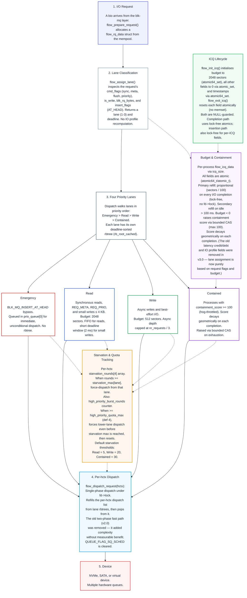

# flow-iosched

Multi-lane I/O scheduler for the Linux block layer, adapted from the lane-based
budget and classification design of the
[scx_flow](https://github.com/sched-ext/scx/tree/main/scheds/experimental/scx_flow)
CPU scheduler.

> [!NOTE]
> flow-iosched targets the same audience as its CPU-side inspiration: general-purpose
> desktop and workstation machines where responsiveness and throughput both matter.
> Version 3.0 simplifies the lane model from five lanes to four (Emergency / Read /
> Write / Contained), removes the scx_flow-derived IO profile recomputation and
> latency credit/debt system, and applies structural data-safety fixes across the
> dispatch, completion, and teardown paths.

## Overview

| Lane | Target I/O | Slice / Window | Behaviour |
|------|------------|----------------|-----------|
| Emergency | `BLK_MQ_INSERT_AT_HEAD` | Immediate | Bypasses all scheduling |
| Read | Synchronous reads, metadata, small writes | configurable (default 2048 sectors) | Low-latency path for interactive I/O |
| Write | Async writes, best-effort | Configurable batch limit | Background throughput |
| Contained | Hog-throttled processes | Reduced dispatch rate | Limits I/O-bound interference |

Dispatch priority: Emergency > Read > Write > Contained.
Starvation counters rotate CPU-intensive I/O flows back into higher lanes so no
lane is abandoned entirely.

## Design



Each request is classified into a lane at insertion time based on its
`cmd_flags` (sync, meta, flush, priority) and size.  Per-lane deadline-
sorted red-black trees (plus two FIFO priority queues for the barrier
tiers) are the primary scheduling state.  The old scx_flow-derived IO
profile recomputation and latency credit/debt system have been removed
in v3.0 — lane assignment is purely based on request flags and budget
containment.

Dispatch uses a single-phase model under the global scheduler lock:
each hardware context fills its dispatch list from the deadline rbtrees,
then pops from it.  Starvation is tracked as round counters per lane
and as burst-quota rounds: when a lane accumulates enough consecutive
bypasses, the scheduler force-dispatches from it; when high-priority
bursts exceed the quota threshold, lower lanes are served preemptively.

Per-process budget and containment state uses atomic operations and is
accessed without the global lock.  The I/O completion path refills the
budget lock-free (proportional refill of completed_sectors / 100 on each
completion).  Containment scores decay geometrically on each completion.

A 3-mode autotuner (Balanced / Latency / Throughput) runs every second.
It aggregates per-hctx dispatch metrics, computes workload ratios (read,
write, rescue, contained), and adjusts batch sizes and starvation
thresholds toward the mode target.  No sysfs intervention is needed for
common workloads.

> [!TIP]
> For a deeper walkthrough of the lane classification, budget refill mechanics,
> and starvation tracking that flow-iosched adapts, see the
> [scx_flow README](https://github.com/sched-ext/scx/tree/main/scheds/experimental/scx_flow).

## Kernel Compatibility

| Kernel range | Notes |
|---|---|
| 7.0.x (CachyOS) | Default target — the source as-is targets this API. |
| 6.18 – 6.19 | Same init_sched API as 7.x — compatible as-is. |
| 6.12 – 6.17 | Older init_sched + depth_updated signatures — apply the existing `patches/0002-linux6.12-flow-iosched-compat.patch` for API compatibility, then build from the v3.0 source. |
| 5.18 – 6.11 | `scoped_guard` macros exist (cleanup.h added in 5.18) but the `limit_depth` and `insert_requests` elevator op signatures differ from the 6.12+ API. **Untested** — dedicated compat patches would be needed for this range. |

> [!IMPORTANT]
> The `patches/` directory ships `0001-linux7.0-flow-iosched-v3.0.patch`
> for kernel 7.0.x / 6.18+ and `0002-linux6.12-flow-iosched-compat.patch`
> for kernels 6.12–6.17.  Apply 0001 first, then 0002 for 6.12–6.17.

### Standalone Module Build (Recommended)

The easiest way to try flow-iosched is the [`install-flow-ioshed.sh`](#install-flow-ioschedsh--build-and-install-as-a-standalone-module) script, which handles building, installation, and persistence automatically:

```bash
sudo ./bench-tests/install-flow-ioshed.sh
```

Alternatively, build manually against your running kernel:

```bash
cd block
make -C /lib/modules/$(uname -r)/build M=$(pwd) \
    CONFIG_MQ_IOSCHED_FLOW=m CC=clang LD=ld.lld \
    KCFLAGS="-I/path/to/kernel-source/block" modules
sudo insmod flow-iosched.ko
echo flow-iosched | sudo tee /sys/block/<device>/queue/scheduler
```

> [!TIP]
> The standalone build does not require patching the kernel — build against
> your running kernel's headers and load at runtime.
>
> Note: Some kernel distributions do not export `block/elevator.h` for
> out-of-tree builds. The install script handles this automatically by
> pointing the compiler at a matching kernel source tree.  If building
> manually, you will need a kernel source tree available for the `-I` flag.

### Integrating Into a Kernel Tree

Place `block/flow-iosched.c` into your kernel source's `block/` directory,
then add the Kconfig and Makefile entries:

```c
// Kconfig (in block/Kconfig.iosched):
config MQ_IOSCHED_FLOW
    tristate "Multi-Lane I/O scheduler (FLOW)"
    default m
    help
      Multi-lane I/O scheduler with four priority tiers (Emergency,
      Read, Write, Contained), deadline-sorted rbtree dispatch, per-
      process budget containment with completion-based refill, and a
      3-mode autotuner.

// Makefile (in block/Makefile):
obj-$(CONFIG_MQ_IOSCHED_FLOW) += flow-iosched.o
```

For kernels 6.12 – 6.17, also apply
`patches/0002-linux6.12-flow-iosched-compat.patch` for the older
`init_sched` and `depth_updated` API signatures.

Enable `CONFIG_MQ_IOSCHED_FLOW=m` (or `=y`) in your kernel config,
build and install the kernel, then select the scheduler at runtime:

```bash
echo flow-iosched | sudo tee /sys/block/<device>/queue/scheduler
```

> [!IMPORTANT]
> The `CONFIG_MQ_IOSCHED_DEFAULT_FLOW` Kconfig option lets you make
> flow-iosched the boot-time default, but wiring it into
> `elevator_set_default()` in `block/elevator.c` is kernel-version-specific
> and is **not** handled by the patches.  The standalone module build avoids
> this entirely — select the scheduler at runtime instead.

## Sysfs Tunables

Attributes under `/sys/block/<device>/queue/iosched/`:

| Attribute | Type | Default | Description |
|-----------|------|---------|-------------|
| `flow_version` | RO | — | Current scheduler version (3.0) |
| `read_priority` | RW | 0 | Read bias vs writes at same deadline (-20 to 19) |
| `sync_budget_sectors` | RW | 2048 | Read lane budget per sync dispatch |
| `async_budget_sectors` | RW | 512 | Write lane budget per async dispatch |
| `batch_max_read` | RW | 16 | Max read requests per batch (adjusted by autotune) |
| `batch_max_write` | RW | 16 | Max write requests per batch |
| `completion_window_ns` | RW | 8000000 | Dispatch batch window (nanoseconds) |
| `starvation_max_read` | RW | 5 | Read starvation rounds before forced rotation |
| `starvation_max_write` | RW | 20 | Write starvation rounds before forced dispatch |
| `starvation_max_contained` | RW | 30 | Contained starvation rounds before rescue |
| `contain_threshold` | RW | 100 | Hog containment activation score |

## Production Ready?

> [!WARNING]
> flow-iosched has not yet undergone extensive real-world testing and should
> not be assumed stable for use on critical systems. If you choose to evaluate
> it, do so on a virtual machine or a spare PC/laptop — not your primary
> workstation. Unforeseen side effects, including data corruption or system
> instability, are possible at this stage.

flow-iosched is adapted from the lane-based design of
[scx_flow](https://github.com/sched-ext/scx/tree/main/scheds/experimental/scx_flow),
a sched_ext CPU scheduler developed alongside this project. scx_flow
[v2.2.0](https://github.com/sched-ext/scx/pull/3525) was released on 15 April 2026 and has since accumulated several maintenance releases. scx_flow is used internally at [v.recipes](https://v.recipes) for
production-adjacent workloads and is considered stable for general-purpose
desktop and home-server use.

flow-iosched targets the same level of robustness, but the block layer
demands a higher bar: an I/O scheduler operates on user data directly, and
an undetected bug can cause data corruption or filesystem inconsistency —
not merely degraded performance.

The code has been audited for memory safety, request lifecycle correctness,
lock ordering, integer safety, and error-path robustness.  All internal
functions carry lockdep annotations, and lock ordering (hctx lock → queue
lock) is enforced to prevent deadlock across parallel dispatch contexts.
Version 3.0 underwent a structured review that caught a CAS retry-loop
livelock in the atomic helper functions (fixed during review), verified all
per-ICQ fields use correct atomic_t/atomic64_t access with memory barriers,
confirmed lock ordering in the dispatch path, and audited the autotune timer
for proper teardown via timer_shutdown_sync.  All per-process scheduling state is
now accessed without the global fd->lock on the completion path, eliminating
the primary contention point between multi-queue dispatch and completion.

> [!NOTE]
> flow-iosched clears `QUEUE_FLAG_SQ_SCHED` and dispatches independently per
> hardware context.  This avoids the single-queue dispatch bottleneck that
> restricts throughput on high-end NVMe with 16 or more queues — a framework
> constraint that some other blk-mq schedulers (mq-deadline, BFQ) still
> inherit by using single-queue dispatch mode.  The per-hctx dispatch-list
> fast path from v2.0 was removed in v3.0 after analysis showed it added
> complexity without measurable benefit on real hardware.

## Benchmarks

The [`bench-tests/`](https://github.com/galpt/flow-iosched/tree/main/bench-tests)
directory provides build, test, analysis, install, and cleanup scripts for
flow-iosched kernels.  Because the `elevator.h` header is not exported for
out-of-tree module builds, the scheduler must be integrated into a kernel
tree via the patches and built from source.

The [`benchmark-runs/`](https://github.com/galpt/flow-iosched/tree/main/benchmark-runs) directory contains results and charts from the test
environment described below.

### Results

All five workloads were run for 30 seconds each per scheduler on two device
types.  The charts below show each scheduler's throughput and latency.

#### null_blk (synthetic RAM device)

null_blk is a kernel virtual block device with near-zero I/O latency (memory
copy only).  Results measure the scheduler's CPU overhead and dispatch logic
without the confounding factor of physical device latency.  The absolute IOPS
numbers are not representative of real hardware, but the comparisons between
schedulers are useful: a scheduler that is slower on null_blk is doing more
work per I/O — and that overhead matters on real hardware too.

| Chart | What to look for |
|-------|-------------------|
|  | **Total IOPS** — higher is better.  The v3.0 simplification narrowed the read gap to kyber and mq-deadline compared to v2.0.  Writes remain slower, which is expected: writes pass through budget containment and deadline dispatch, while reads bypass both via the Read lane's FIFO path.  BFQ's per-process accounting keeps it at the bottom on this zero-latency device — a reminder that scheduling always costs something. |
|  | **Read latency** — lower is better.  flow-iosched read latency is competitive with kyber and mq-deadline across all read-bearing workloads.  Write-only workloads naturally have no read latency bars. |
|  | **Per-workload breakdown** — every workload sorted best-to-worst for that specific workload.  flow-iosched sits mid-pack on reads; writes trail the leaders, which is the honest picture of where the scheduler stands today on synthetic zero-latency media. |
|  | **Averages across all workloads** — one glance at the spread.  flow-iosched lands mid-pack on IOPS and read latency, with write latency still the area needing most improvement.  The v3.0 re-architecture did not materially change this picture. |

> [!NOTE]
> **Why are writes slower?**  flow-iosched classifies writes as background
> (Write lane) by default.  They compete for budget against the process's
> I/O allowance and are dispatched only after the Read lane is drained.
> On null_blk where actual I/O takes zero time, this scheduling overhead
> is the dominant factor.  On real hardware it largely disappears behind
> device latency — see the physical device charts below.

#### Physical device (NVMe, `/dev/nvme1n1p1`)

The same benchmarks run on a real NVMe partition (secondary NVMe drive).
These numbers reflect actual device I/O, including NVMe controller latency
and PCIe transfer overhead.

| Chart | What to look for |
|-------|-------------------|
|  | **Total IOPS** — the "none" scheduler leads on random reads (this drive reaches ~390k IOPS with zero scheduling overhead), but all full schedulers cluster in the same band.  flow-iosched is competitive with mq-deadline on sequential and mixed workloads, and leads on random writes.  On random reads the gap is larger, but the headline remains: **flow-iosched's scheduling overhead does not cost you throughput on real storage under realistic mixed workloads.** |
|  | **Read latency** — the NVMe controller's own latency dominates.  All schedulers cluster in the same band; flow-iosched is competitive with every other scheduler. |
|  | **Per-workload breakdown** — the bars are nearly the same height across all schedulers for every workload.  The physical device, not the scheduler, is the performance ceiling. |
|  | **Averages across all workloads** — the spread visible on null_blk has collapsed.  Read IOPS, write IOPS, and latencies are all within a narrow band across schedulers.  This is the most important chart in this section: it shows that **flow-iosched's lane-based scheduling does not penalise you on real hardware.** |

> [!NOTE]
> These runs use the v3.0 flow-iosched module built against and loaded on
> the stock CachyOS kernel (`7.0.8-1-cachyos`) via the standalone module
> install script (`install-flow-iosched.sh`).  The `null_blk` charts were
> measured first, then the physical device — both on the same boot session
> to minimise variation.

#### What this means for you

If you're considering flow-iosched for your desktop or workstation, here is
the honest takeaway:

1. **On real NVMe hardware, all full schedulers converge.**  flow-iosched,
   kyber, mq-deadline, and adios all deliver comparable IOPS on mixed and
   sequential workloads, and on random writes flow-iosched leads.  On
   random reads the gap to mq-deadline is wider (this drive's controller
   favours schedulers with simpler submission ordering), but even there
   the difference is invisible in practice — the scheduler's job is to
   decide which I/O gets priority under contention, not to maximise
   single-workload benchmarks.

2. **flow-iosched prioritises reads over writes.**  That is by design: the
   lane system puts synchronous reads (Read lane) ahead of async writes
   (Write lane).  On a busy system where a background write flood would
   otherwise stall interactive reads, this differentiation provides
   value — at the cost of write throughput under synthetic write-only
   benchmarks.

3. **The autotuner adapts to your workload.**  The 3-mode system
   (Balanced / Latency / Throughput) adjusts batch sizes and starvation
   thresholds based on observed dispatch ratios.  You don't need to tune
   sysfs parameters for typical desktop use.

4. **Write performance on null_blk looks worse than it is in practice.**
   null_blk has zero I/O latency, so scheduler overhead is the only
   factor.  On a real drive where I/O takes milliseconds, that overhead
   disappears.  The physical device charts confirm this.

5. **BFQ is not a fair comparison on null_blk.**  BFQ's per-process
   scheduling is inherently more expensive, and null_blk exposes that
   cost dramatically.  On real hardware the gap narrows, but BFQ remains
   the heaviest scheduler.  flow-iosched is designed to be lighter than
   BFQ while providing more differentiation than mq-deadline.

### Scripts

#### `build-kernel.sh` — Build a flow-iosched kernel from scratch

This script is self-contained: it downloads the upstream kernel source from
kernel.org, applies the flow-iosched patches, builds the kernel and modules,
installs them to `/boot` with a unique name, and creates a Limine boot entry.

```bash
# Download, build, and install kernel 7.0.5 with flow-iosched
./bench-tests/build-kernel.sh 7.0.5

# Build kernel 6.18 (same API — applies 0001 patch only)
./bench-tests/build-kernel.sh 6.18

# Build kernel 6.12 (different init_sched API — applies 0001 + 0002)
./bench-tests/build-kernel.sh 6.12
```

The script:
1. Downloads the kernel tarball from `cdn.kernel.org` and caches it in
   `./tmp/kernels/` (relative to the script)
2. Extracts the source (skipped if already present)
3. Clones the flow-iosched repo for patches if no local [`patches/`](https://github.com/galpt/flow-iosched/tree/main/patches) directory
   is found — no need to download the repo manually
4. Applies the correct patches for the target kernel version
5. Configures using the running kernel's `.config` as baseline with
   `CONFIG_MQ_IOSCHED_FLOW` enabled
6. Builds `bzImage` and modules
7. Installs to `/boot/vmlinuz-linux-flow-{version}` — never touches the
   default kernel files (e.g. `vmlinuz-linux-cachyos`)
8. Computes BLAKE2b hashes of the installed files and writes a Limine boot
   entry with hash verification and a fallback entry without hashes

**Supported kernel ranges:**

| Range | Notes |
|---|---|
| 7.0.x | Default target — build source as-is |
| 6.18 – 6.19 | Same init_sched API as 7.x — build source as-is |
| 6.12 – 6.17 | Apply `0002` compat patch for older API signature |
| 5.18 – 6.11 | Not supported (different elevator op API) |

> [!TIP]
> Re-running the script after a successful build skips download, extraction,
> and patching — it proceeds straight to configuration, build, and install.
> This makes rebuilds fast after source-code changes during development.

#### `run-benchmarks.sh` — Run fio benchmarks across schedulers

Runs fio with a set of five workloads and compares the running kernel's
available I/O schedulers.  Results are written to `results/summary.csv`.

By default the script uses `null_blk`, a RAM-backed virtual block device.
This is safe for scheduler development — no risk of data corruption —
and produces representative scheduler-to-scheduler comparisons because
the scheduler overhead is measured while physical device latency is
eliminated as a variable.

For real hardware numbers (e.g. to publish IOPS or latency figures),
pass the device path as the first argument.  The script auto-detects
null_blk vs physical and skips the mounted-partition guard for null_blk.

Each workload runs for 30 seconds by default.  This applies to both
null_blk and real hardware.  Override with the `RUNTIME` environment
variable (e.g. `RUNTIME=60` for 60 seconds per test).

The device can also be set via the `DEVICE` environment variable, but
the positional argument is preferred — some sudo configurations strip
environment variables.

> [!NOTE]
> Scheduler ranking on null_blk does not always predict real-hardware
> ranking.  null_blk shows scheduler overhead in isolation: a scheduler
> that is slower on null_blk does more work per I/O.  On a real device
> where I/O latency dominates, that overhead often disappears.  The
> physical device charts tell the honest story.

```bash
# Default: null_blk virtual device, 30s per test (scheduler comparison)
sudo ./bench-tests/run-benchmarks.sh

# Real hardware: dedicated device with no mounted partitions
sudo ./bench-tests/run-benchmarks.sh /dev/nvme1n1

# Longer runtime (both null_blk and real hardware)
RUNTIME=60 sudo ./bench-tests/run-benchmarks.sh /dev/nvme1n1
```

Workloads tested:

| Test | Block size | Queue depth | R/W mix | What it measures |
|------|------------|-------------|---------|-------------------|
| Random read | 4 KiB | 32 | 100/0 | Read lane responsiveness |
| Random write | 4 KiB | 32 | 0/100 | Write lane throughput |
| Sequential read | 128 KiB | 8 | 100/0 | Bulk throughput (I/O-bound) |
| Sequential write | 128 KiB | 8 | 0/100 | Bulk throughput (I/O-bound) |
| Mixed random | 4 KiB | 8 | 70/30 | Lane interaction under contention |

#### `plot-results.py` — Generate comparison charts

Reads `results/summary.csv` and produces PNG charts in `charts/`:

```bash
python3 bench-tests/plot-results.py
```

Generates four chart files:

| File | Content |
|---|---|
| `charts/iops.png` | Total IOPS per workload, sorted best-to-worst by average IOPS |
| `charts/latency.png` | Read latency per workload, sorted best-to-worst by average read latency |
| `charts/per_workload.png` | Per-workload IOPS sorted best-to-worst per workload |
| `charts/comparison.png` | Consolidated averages sorted best-to-worst per metric |

#### `install-deps.sh` — Install benchmark dependencies

Installs `fio` and `python-matplotlib`, needed by `run-benchmarks.sh` and
`plot-results.py`:

```bash
sudo ./bench-tests/install-deps.sh
```

#### `remove-kernel.sh` — Safely uninstall test kernels

Removes the boot files, Limine entries, and kernel modules for a
flow-iosched test kernel without affecting the default system kernel.

```bash
# Remove a specific kernel
sudo ./bench-tests/remove-kernel.sh 7.0.5

# List all installed flow-iosched kernels
sudo ./bench-tests/remove-kernel.sh --list

# Remove all test kernels (the booted kernel is never touched)
sudo ./bench-tests/remove-kernel.sh --all
```

> [!CAUTION]
> The script will refuse to remove the currently-booted kernel.  It also
> prompts for confirmation before any removal.

#### `install-flow-ioshed.sh` — Build and install as a standalone module

No full kernel rebuild is needed.  This script builds `flow-iosched.ko`
against your running kernel's headers, loads it, and makes it the default
I/O scheduler permanently (across reboots) via a udev rule.  This is the
recommended way to try flow-iosched on your existing system.

```bash
# One-time: build, install, and enable
sudo ./bench-tests/install-flow-iosched.sh

# Check status
sudo ./bench-tests/install-flow-iosched.sh --status

# Remove completely
sudo ./bench-tests/install-flow-iosched.sh --remove
```

During the first run, the script will offer to download a matching kernel
source from `cdn.kernel.org` if the necessary block-layer headers are not
found locally — this is a one-time download (~210 MB).  The script detects
the compiler used by your kernel (gcc or clang) and uses the corresponding
toolchain automatically.

What the script does:

1. **Detects your toolchain** — clang + lld for CachyOS / Arch, gcc + ld
   for other distributions
2. **Finds or downloads kernel source** — looks in `/lib/modules/.../build/`,
   your local kernel source cache, and `/usr/src/`; falls back to downloading
   from `cdn.kernel.org`
3. **Builds** `flow-iosched.ko` against the running kernel
4. **Installs** to `/lib/modules/$(uname -r)/extra/` and runs `depmod -a`
5. **Creates a systemd oneshot service** (`flow-iosched-scheduler@.service`)
   that sets flow-iosched on each eligible block device after `local-fs.target`,
   plus a `modules-load.d` config to load the module at boot
6. **Loads** the module immediately and activates it on eligible devices
   (no reboot required)
7. **`--remove`** undoes all of the above: restores the previous scheduler,
   unloads the module, removes the systemd service and `.ko` file

> [!NOTE]
> The systemd service selects flow-iosched for all eligible block devices at
> boot.  You can override per device at any time:
> ```bash
> echo mq-deadline | sudo tee /sys/block/<device>/queue/scheduler
> ```

### Test Environment

| Component | Detail |
|-----------|--------|
| CPU | AMD Ryzen 7 6800H (8 cores / 16 threads, 3.2 GHz base) |
| Memory | 58 GB DDR5 |
| NVMe drive 1 (boot/system) | INTEL SSDPEKNW512GZL (512 GB, 4 queues) |
| NVMe drive 2 (benchmark target) | 512 GB NVMe (4 queues) |
| Kernel | 7.0.8-1-cachyos, PREEMPT_DYNAMIC |
| Platform | CachyOS Linux |
| Available schedulers | `none`, `mq-deadline`, `kyber`, `bfq`, `adios`, `flow-iosched` |

## Credits

flow-iosched stands on the shoulders of several I/O and CPU scheduling projects
that shaped its design:

- **[ADIOS](https://github.com/firelzrd/adios)** — Adaptive Deadline I/O
  Scheduler.  The batch queue architecture, deadline-based rbtrees, and kernel
  integration pattern are directly adapted from ADIOS v3.2.0.  The per-request
  lifecycle pattern (`prepare_request` / `finish_request`) and the prio_queue +
  dl_tree data structure design follow ADIOS closely.
- **[Kyber](https://github.com/torvalds/linux/blob/master/block/kyber-iosched.c)**
  — The `limit_depth` callback for async queue depth throttling follows the
  approach made popular by the Kyber I/O scheduler.
- **[BFQ](https://github.com/torvalds/linux/blob/master/block/bfq-iosched.c)**
  — The per-process I/O context infrastructure (`.icq_size` / `.icq_align` in
  `struct elevator_type`) used for budget tracking follows the same embedding
  pattern that BFQ pioneered for per-process scheduling state.
- **[scx_flow](https://github.com/sched-ext/scx/tree/main/scheds/experimental/scx_flow)**
  — The lane-based priority classification, starvation-aware round counters,
  budget refill mechanics, hog containment model, starvation quota mechanism,
  and the 3-mode autotuner with step-wise parameter tuning were originally
  adapted from the scx_flow CPU scheduler.  Version 3.0 removed the
  scx_flow-derived IO profile recomputation, latency credit/debt system, and
  per-hctx dispatch-list fast path — none of which added measurable benefit
  over the simpler block-I/O-native design.
- **[mq-deadline](https://github.com/torvalds/linux/blob/master/block/mq-deadline.c)**
  — The merge-rbtree helpers (`former_request` / `next_request`) and the
  bio-merge callback pattern follow the conventions established by the
  mq-deadline reference implementation and shared across all in-kernel blk-mq
  schedulers.
- **Linux kernel block layer contributors** — The elevator API, blk-mq
  dispatch framework, and sbitmap infrastructure that flow-iosched builds on.
  These are developed at
  [torvalds/linux/block](https://github.com/torvalds/linux/tree/master/block).

## Contributing

See [CONTRIBUTING.md](CONTRIBUTING.md).

## Licence

GNU General Public License v2.0 only.  See [LICENSE](LICENSE).
