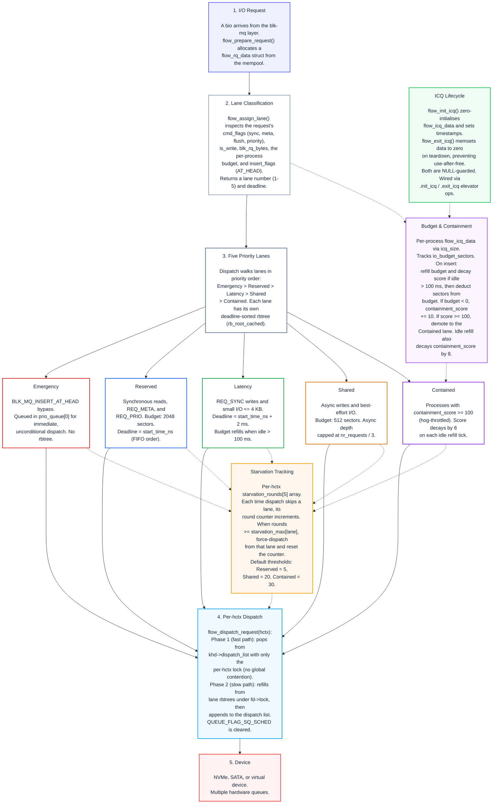

# flow-iosched

Multi-lane I/O scheduler for the Linux block layer, adapted from the lane-based
budget and classification design of the
[scx_flow](https://github.com/sched-ext/scx/tree/main/scheds/experimental/scx_flow)
CPU scheduler.

> [!NOTE]
> flow-iosched targets the same audience as its CPU-side inspiration: general-purpose
> desktop and workstation machines where responsiveness and throughput both matter.

## Overview

| Lane | Target I/O | Slice / Window | Behaviour |
|------|------------|----------------|-----------|
| Emergency | `BLK_MQ_INSERT_AT_HEAD` | Immediate | Bypasses all scheduling |
| Reserved | Synchronous reads, metadata | configurable (default 2048 sectors) | Low-latency path for interactive I/O |
| Latency | Small random I/O | Short batch window | Bounded responsiveness |
| Shared | Async writes, best-effort | Configurable batch limit | Background throughput |
| Contained | Hog-throttled processes | Reduced dispatch rate | Limits I/O-bound interference |

Dispatch priority: Emergency > Reserved > Latency > Shared > Contained.
Starvation counters rotate CPU-intensive I/O flows back into higher lanes so no
lane is abandoned entirely.

## Design



Each request is classified into a lane at insertion time based on its
`cmd_flags` (sync, meta, flush, priority) and the originating process's I/O
budget balance.  Per-lane deadline-sorted red-black trees (plus two FIFO
priority queues for the barrier tiers) are the primary scheduling state.

Dispatch uses a per-hardware-context fast-path: each hardware context
maintains its own dispatch list and starvation counters.  The dispatcher
first attempts a lock-free pop from the per-hctx dispatch list; if empty,
it walks the global lane trees under a short-lived lock to refill the list.
This allows independent dispatch across multiple hardware queues while
preserving the lane priority order.  Starvation is tracked as round
counters per lane — when a lane accumulates enough consecutive bypasses the
scheduler force-dispatches from it, ensuring fairness without wall-clock
timers.

Processes that exceed their I/O budget accumulate a containment score; once
the score passes the containment threshold their I/O is demoted to the
contained lane until the score decays below the threshold again.

> [!TIP]
> For a deeper walkthrough of the lane classification, budget refill mechanics,
> and starvation tracking that flow-iosched adapts, see the
> [scx_flow README](https://github.com/sched-ext/scx/tree/main/scheds/experimental/scx_flow).

## Kernel Compatibility

| Kernel range | Notes |
|---|---|
| 7.0.x (CachyOS) | Default target — use source as-is.  (CachyOS ships `MQ_IOSCHED_ADIOS` which uses the same elevator API.) |
| 6.18 – 6.19 | Same init_sched API as 7.x — use source as-is. |
| 6.12 – 6.17 | Older init_sched + depth_updated signatures — apply `patches/0002-linux6.12-flow-iosched-compat.patch` after applying `patches/0001-linux7.0-flow-iosched-v1.1.0.patch`. |
| 5.18 – 6.11 | `scoped_guard` macros exist (cleanup.h added in 5.18) but the `limit_depth` and `insert_requests` elevator op signatures differ from the 6.12+ API. **Untested** — a dedicated compat patch would be needed for this range. |

The `patches/` directory follows the approach used by
[ADIOS](https://github.com/firelzrd/adios), shipping separate patches per
kernel cycle.

### Building as a Standalone Module (Recommended)

> [!TIP]
> The standalone build does not require patching the kernel — build against
> your running kernel's headers and load at runtime.
>
> Note: Some kernel distributions do not export `block/elevator.h` for
> out-of-tree builds. In that case you can copy the header from the kernel
> source tree or build the scheduler as an integrated module via the
> `patches/` approach below.

```bash
cd block
make -C /lib/modules/$(uname -r)/build M=$(pwd)
sudo insmod flow-iosched.ko
echo flow-iosched | sudo tee /sys/block/<device>/queue/scheduler
```

To make the selection persist across reboots, add the `echo` line to your
initramfs scripts (e.g. `/etc/initramfs-tools/scripts/init-top/`).

### Integrating Into a Kernel Tree

1. Apply `patches/0001-linux7.0-flow-iosched-v1.1.0.patch` — creates the
   scheduler source, Kconfig entry, and Makefile target.
2. For kernels 6.12 – 6.17, also apply
   `patches/0002-linux6.12-flow-iosched-compat.patch`.
3. Enable `CONFIG_MQ_IOSCHED_FLOW=m` (or `=y`) in your kernel config.
4. Build and install the kernel, then select the scheduler at runtime:

   ```bash
   echo flow-iosched | sudo tee /sys/block/<device>/queue/scheduler
   ```

> [!IMPORTANT]
> The `CONFIG_MQ_IOSCHED_DEFAULT_FLOW` Kconfig option lets you make
> flow-iosched the boot-time default, but wiring it into
> `elevator_set_default()` in `block/elevator.c` is kernel-version-specific
> and is **not** handled by the patches.  The standalone module build avoids
> this entirely — select the scheduler at runtime instead.

## Sysfs Tunables

Attributes under `/sys/block/<device>/queue/iosched/`:

| Attribute | Type | Default | Description |
|-----------|------|---------|-------------|
| `flow_version` | RO | — | Current scheduler version |
| `read_priority` | RW | 0 | Read bias vs writes at same deadline (-20 to 19) |
| `sync_budget_sectors` | RW | 2048 | Reserved lane budget per sync dispatch |
| `async_budget_sectors` | RW | 512 | Shared lane budget per async dispatch |
| `batch_max_read` | RW | 16 | Max read requests per batch |
| `batch_max_write` | RW | 16 | Max write requests per batch |
| `completion_window_ns` | RW | 8000000 | Dispatch batch window (nanoseconds) |
| `starvation_max_reserved` | RW | 5 | Reserved starvation rounds before forced rotation |
| `starvation_max_shared` | RW | 20 | Shared starvation rounds before forced dispatch |
| `starvation_max_contained` | RW | 30 | Contained starvation rounds before rescue |
| `contain_threshold` | RW | 100 | Hog containment activation score |
| `contain_decay_step` | RW | 8 | Containment score decay per idle interval |

## Production Ready?

> [!WARNING]
> flow-iosched has not yet undergone extensive real-world testing and should
> not be assumed stable for use on critical systems. If you choose to evaluate
> it, do so on a virtual machine or a spare PC/laptop — not your primary
> workstation. Unforeseen side effects, including data corruption or system
> instability, are possible at this stage.

flow-iosched is adapted from the lane-based design of
[scx_flow](https://github.com/sched-ext/scx/tree/main/scheds/experimental/scx_flow),
a sched_ext CPU scheduler developed alongside this project. scx_flow
[v2.2.0](https://github.com/sched-ext/scx/commit/00003869) was released in
April 2026 and has since accumulated several maintenance releases (current:
v2.2.5). It is used internally at [v.recipes](https://v.recipes) for
production-adjacent workloads and is considered stable for general-purpose
desktop and home-server use.

flow-iosched targets the same level of robustness, but the block layer
demands a higher bar: an I/O scheduler operates on user data directly, and
an undetected bug can cause data corruption or filesystem inconsistency —
not merely degraded performance. The code has been audited for counter
edge cases (starvation rounds, containment scoring, budget arithmetic),
memory allocation paths, and rbtree lifecycle correctness.  All internal
functions carry lockdep annotations, and lock ordering (hctx lock → queue
lock) is enforced to prevent deadlock across parallel dispatch contexts.

This audit discovered and fixed a scheduling bypass bug where every
non-emergency request was incorrectly added to a FIFO tracking list
alongside its lane rbtree, causing dispatch to bypass the lane priority
system entirely.  The presence of a real, testable logic error in the
current code underscores why the scheduler should be treated as
experimental until it has accumulated more field testing across varied
hardware and workloads.

> [!NOTE]
> flow-iosched clears `QUEUE_FLAG_SQ_SCHED` and dispatches independently per
> hardware context.  This avoids the single-queue dispatch bottleneck that
> restricts throughput on high-end NVMe with 16 or more queues — a framework
> constraint that some other blk-mq schedulers (mq-deadline, BFQ) still
> inherit by using single-queue dispatch mode.

## Benchmarks

The [`bench-tests/`](https://github.com/galpt/flow-iosched/tree/main/bench-tests)
directory provides build, test, analysis, install, and cleanup scripts for
flow-iosched kernels.  Because the `elevator.h` header is not exported for
out-of-tree module builds, the scheduler must be integrated into a kernel
tree via the patches and built from source.

The `benchmark-runs/` directory contains results and charts from the test
environment described below.

### Results

All five workloads were run for 30 seconds each per scheduler on two device
types.  The charts below show each scheduler's throughput and latency.

#### null_blk (synthetic RAM device)

null_blk is a kernel virtual block device with near-zero I/O latency (memory
copy only).  Results measure the scheduler's CPU overhead and dispatch logic
without the confounding factor of physical device latency.  Scheduler ranking
tends to be consistent between null_blk and real hardware — if flow-iosched
is 15% faster on null_blk, it will generally be faster on real NVMe too.
The absolute IOPS numbers are not representative of real hardware.

| Chart | Description |
|---|---|
|  | **Total IOPS** per workload — higher is better.  Flow-iosched and none are consistently ahead, with BFQ CPU overhead reducing throughput on this memory-backed device. |
|  | **Read latency** per workload — lower is better.  The logarithmic scale accommodates the wide range (BFQ is 4–5× slower than the rest on null_blk due to its per-process queue accounting overhead).  Write-only workloads (Rand Write 4k, Seq Write 128k) naturally have no read latency. |
|  | **Per-workload IOPS** sorted best to worst — makes the scheduler ordering clear for each workload individually. |
|  | **Consolidated averages** across all workloads, sorted best to worst per metric.  IOPS averaged from all five workloads; read and write latency averaged from read- and write-capable workloads respectively. |

#### Physical device (Intel NVMe, `/dev/nvme0n1p1`)

The same benchmarks run on a real NVMe partition (Intel SSD on the secondary
NVMe slot, `nvme0n1p1`).  These numbers reflect actual device I/O, including
NVMe controller latency and PCIe transfer overhead.

| Chart | Description |
|---|---|
|  | **Total IOPS** per workload.  The gap between schedulers narrows compared to null_blk because physical I/O latency becomes the dominant factor. |
|  | **Read latency** per workload.  All schedulers converge more closely than on null_blk — the device's own latency masks scheduler overhead on sequential and mixed workloads. |
|  | **Per-workload IOPS** sorted best to worst. |
|  | **Consolidated averages** across all workloads.  Note the narrower spread — the physical device is the bottleneck, not the scheduler. |

> [!NOTE]
> The test kernel in these runs is `7.0.5-flow` with flow-iosched built in
> (`CONFIG_MQ_IOSCHED_FLOW=y`), booted on the CachyOS host system.  The
> `null_blk` charts were measured first, then the physical device — both
> on the same boot session to minimise variation.

### Scripts

#### `build-kernel.sh` — Build a flow-iosched kernel from scratch

This script is self-contained: it downloads the upstream kernel source from
kernel.org, applies the flow-iosched patches, builds the kernel and modules,
installs them to `/boot` with a unique name, and creates a Limine boot entry.

```bash
# Download, build, and install kernel 7.0.5 with flow-iosched
./bench-tests/build-kernel.sh 7.0.5

# Build kernel 6.18 (same API — applies 0001 patch only)
./bench-tests/build-kernel.sh 6.18

# Build kernel 6.12 (different init_sched API — applies 0001 + 0002)
./bench-tests/build-kernel.sh 6.12
```

The script:
1. Downloads the kernel tarball from `cdn.kernel.org` and caches it in
   `./tmp/kernels/` (relative to the script)
2. Extracts the source (skipped if already present)
3. Clones the flow-iosched repo for patches if no local `patches/` directory
   is found — no need to download the repo manually
4. Applies the correct patches for the target kernel version
5. Configures using the running kernel's `.config` as baseline with
   `CONFIG_MQ_IOSCHED_FLOW` enabled
6. Builds `bzImage` and modules
7. Installs to `/boot/vmlinuz-linux-flow-{version}` — never touches the
   default kernel files (e.g. `vmlinuz-linux-cachyos`)
8. Computes BLAKE2b hashes of the installed files and writes a Limine boot
   entry with hash verification and a fallback entry without hashes

**Supported kernel ranges:**

| Range | Patches applied | Notes |
|---|---|---|
| 7.0.x | `0001` only | Default target |
| 6.18 – 6.19 | `0001` only | Same init_sched API as 7.x |
| 6.12 – 6.17 | `0001` + `0002` | Older init_sched signature |
| 5.18 – 6.11 | — | Not supported (different elevator op API) |

> [!TIP]
> Re-running the script after a successful build skips download, extraction,
> and patching — it proceeds straight to configuration, build, and install.
> This makes rebuilds fast after source-code changes during development.

#### `run-benchmarks.sh` — Run fio benchmarks across schedulers

Runs fio with a set of five workloads and compares the running kernel's
available I/O schedulers.  Results are written to `results/summary.csv`.

By default the script uses `null_blk`, a RAM-backed virtual block device.
This is safe for scheduler development — no risk of data corruption —
and produces representative scheduler-to-scheduler comparisons because
the scheduler overhead is measured while physical device latency is
eliminated as a variable.

For real hardware numbers (e.g. to publish IOPS or latency figures),
pass the device path as the first argument.  The script auto-detects
null_blk vs physical and skips the mounted-partition guard for null_blk.

Each workload runs for 30 seconds by default.  This applies to both
null_blk and real hardware.  Override with the `RUNTIME` environment
variable (e.g. `RUNTIME=60` for 60 seconds per test).

The device can also be set via the `DEVICE` environment variable, but
the positional argument is preferred — some sudo configurations strip
environment variables.

> [!NOTE]
> Scheduler ranking (flow vs mq-deadline vs bfq) tends to be consistent
> between null_blk and physical hardware.  If flow is 15% faster on
> null_blk, it will generally be faster on real NVMe too.  The absolute
> numbers differ — null_blk shows scheduler overhead only, real I/O
> includes device latency — but the ratios are usefully predictive.

```bash
# Default: null_blk virtual device, 30s per test (scheduler comparison)
sudo ./bench-tests/run-benchmarks.sh

# Real hardware: dedicated device with no mounted partitions
sudo ./bench-tests/run-benchmarks.sh /dev/nvme1n1

# Longer runtime (both null_blk and real hardware)
RUNTIME=60 sudo ./bench-tests/run-benchmarks.sh /dev/nvme1n1
```

Workloads tested:

| Test | Block size | Queue depth | R/W mix | What it measures |
|---|---|---|---|---|
| Random read | 4 KiB | 32 | 100/0 | Latency lane responsiveness |
| Random write | 4 KiB | 32 | 0/100 | Shared lane throughput |
| Sequential read | 128 KiB | 8 | 100/0 | Bulk throughput (I/O-bound) |
| Sequential write | 128 KiB | 8 | 0/100 | Bulk throughput (I/O-bound) |
| Mixed random | 4 KiB | 8 | 70/30 | Lane interaction under contention |

#### `plot-results.py` — Generate comparison charts

Reads `results/summary.csv` and produces PNG charts in `charts/`:

```bash
python3 bench-tests/plot-results.py
```

Generates four chart files:

| File | Content |
|---|---|
| `charts/iops.png` | Total IOPS per workload, sorted best-to-worst by average IOPS |
| `charts/latency.png` | Read latency per workload, sorted best-to-worst by average read latency |
| `charts/per_workload.png` | Per-workload IOPS sorted best-to-worst per workload |
| `charts/comparison.png` | Consolidated averages sorted best-to-worst per metric |

#### `install-deps.sh` — Install benchmark dependencies

Installs `fio` and `python-matplotlib`, needed by `run-benchmarks.sh` and
`plot-results.py`:

```bash
sudo ./bench-tests/install-deps.sh
```

#### `remove-kernel.sh` — Safely uninstall test kernels

Removes the boot files, Limine entries, and kernel modules for a
flow-iosched test kernel without affecting the default system kernel.

```bash
# Remove a specific kernel
sudo ./bench-tests/remove-kernel.sh 7.0.5

# List all installed flow-iosched kernels
sudo ./bench-tests/remove-kernel.sh --list

# Remove all test kernels (the booted kernel is never touched)
sudo ./bench-tests/remove-kernel.sh --all
```

> [!CAUTION]
> The script will refuse to remove the currently-booted kernel.  It also
> prompts for confirmation before any removal.

### Test Environment

| Component | Detail |
|---|---|
| CPU | AMD Ryzen 7 6800H (8 cores / 16 threads, 3.2 GHz base) |
| Memory | 58 GB DDR5 |
| NVMe drive 1 | 512 GB (NVMe, 4 queues) |
| NVMe drive 2 | Intel SSDPEKNW512GZL (512 GB, 4 queues) |
| Kernel | 7.0.5-2-cachyos, PREEMPT_DYNAMIC |
| Platform | CachyOS Linux |
| Available schedulers | `none`, `mq-deadline`, `kyber`, `bfq`, `adios` |

## Credits

flow-iosched stands on the shoulders of several I/O and CPU scheduling projects
that shaped its design:

- **[ADIOS](https://github.com/firelzrd/adios)** — Adaptive Deadline I/O
  Scheduler.  The batch queue architecture, deadline-based rbtrees, and kernel
  integration pattern are directly adapted from ADIOS v3.2.0.  The per-request
  lifecycle pattern (`prepare_request` / `finish_request`) and the prio_queue +
  dl_tree data structure design follow ADIOS closely.
- **[Kyber](https://github.com/torvalds/linux/blob/master/block/kyber-iosched.c)**
  — The `limit_depth` callback for async queue depth throttling follows the
  approach made popular by the Kyber I/O scheduler.
- **[BFQ](https://github.com/torvalds/linux/blob/master/block/bfq-iosched.c)**
  — The per-process I/O context infrastructure (`.icq_size` / `.icq_align` in
  `struct elevator_type`) used for budget tracking follows the same embedding
  pattern that BFQ pioneered for per-process scheduling state.
- **[scx_flow](https://github.com/sched-ext/scx/tree/main/scheds/experimental/scx_flow)**
  — The lane-based priority classification, starvation-aware round counters,
  budget refill mechanics, and hog containment model are direct adaptations of
  the scx_flow CPU scheduler's design for the block layer.
- **[mq-deadline](https://github.com/torvalds/linux/blob/master/block/mq-deadline.c)**
  — The merge-rbtree helpers (`former_request` / `next_request`) and the
  bio-merge callback pattern follow the conventions established by the
  mq-deadline reference implementation and shared across all in-kernel blk-mq
  schedulers.
- **Linux kernel block layer contributors** — The elevator API, blk-mq
  dispatch framework, and sbitmap infrastructure that flow-iosched builds on.
  These are developed at
  [torvalds/linux/block](https://github.com/torvalds/linux/tree/master/block).

## Contributing

See [CONTRIBUTING.md](CONTRIBUTING.md).

## Licence

GNU General Public License v2.0 only.  See [LICENSE](LICENSE).
